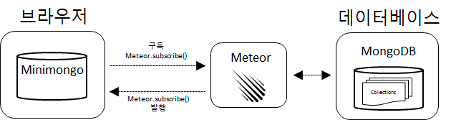

# 1장 미티어 소개

미티어는 클라이언트\(브라우저\)부터 애플리케이션 서버\(미티어 서버\), 데이터베이스\(몽고DB\)에 이르기까지 자바스크립트로 구성된 풀스택 플랫폼이다. 또한, 미티어는 명령어 한 줄만으로 빠르게 개발 환경을 구성할 수 있으며, 브라우저부터 데이터베이스까지 실시간으로 데이터를 동기화하는 애플리케이션을 쉽게 작성할 수 있다. 미티어 패키지 저장소\(atmosphere\)에 있는 수많은 패키지를 나의 프로젝트에 설치하고 사용할 수 있다.

## 1.1 빠르게 구성하는 개발 환경

미티어는 명령줄에서 입력하는 한 줄의 프로젝트 생성 명령 만으로 자체에 내장된 데이터베이스를 사용할 수 있다. 내장된 몽고DB\(www.mongodb.com\)는 JSON\(JavaScript Object Notation, www.json.org\)을 저장하는 데이터베이스로 요즘 주목받고 있는 NoSQL 데이터베이스 중 하나다. 물론 운영 환경에서는 외부에 있는 별도의 몽고DB를 사용하여 시스템을 구성하는 것도 가능하다.

## 1.2 브라우저와 서버간 실시간 데이터 동기화

미티어는 발행/구독\(publish/subscribe\)이라는 구조로 브라우저와 서버 간의 데이터 교환이 이루어 진다. 이 교환은 실시간으로 이루어지므로 데이터의 지속적인 변화를 실시간으로 보여주는 애플리케이션을 작성할 때 아주 좋다. 게다가 코드 몇 줄 만으로 쉽게 동기화를 구현할 수 있다. 자세한 내용은 본문의 예제와 31장 발행과 구독의 이해에서 소개한다.

